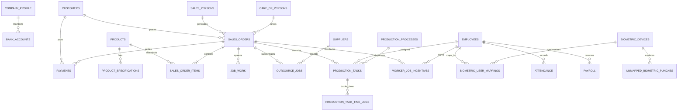

# 03. DATABASE ENTITY RELATIONSHIPS & DATA LIFECYCLE

## 1. Entity-Relationship (ER) Visual Model

---

## 2. Core Business Lifecycle Relationships

### Phase 1: Customer & Quotation Pipeline
1. **`customers`** (1) ───< **`sales_orders`** (Many):
   - A customer can place multiple quotations or firm orders.
   - When a customer is created, their credit limit and default payment terms are checked.
   - `sales_orders.customer_id` references `customers.id`. If a customer record is deleted, `ON DELETE SET NULL` preserves the historical sales order and tax invoice for statutory GST compliance.

2. **Quotation to Order Transition**:
   - In this ERP, quotations are created directly within `sales_orders` with status `'Quotation'` or order ID prefix `QT-`.
   - When the customer confirms artwork and pays the advance deposit (typically 50%), the quotation is converted into an active Sales Order with `production_status = 'New'` and `order_number = 'SO-XXXX'`.

### Phase 2: Order Decomposition to Job Cards & Items
3. **`sales_orders`** (1) ───< **`sales_order_items`** (Many):
   - An order (e.g. `SO-1001`) can contain multiple distinct items (e.g., Line 1: 1000 Business Cards, Line 2: 2x 10x4ft Flex Banners, Line 3: 1x Acrylic LED Glow Signboard).
   - **Historical Snapshot Pattern**: `sales_order_items` stores `product_name_snapshot`, `spec_name`, `material`, `selling_rate`, `width`, and `height`. If the master product price or name changes in `products` later, historical orders and tax invoices remain immutable.
   - Cascade policy: `ON DELETE CASCADE`. Deleting a draft order removes its child line items.

4. **`sales_order_items`** (1) ───< **`production_tasks`** (Many):
   - Each complex item spawns discrete routing tasks based on necessary printing processes.
   - Example for Item: "10x4ft Star Flex Banner":
     - Task 1: Rip & Print on Large Format Flex Press (Operator: Afsal)
     - Task 2: Cutting & Perimeter Hemming (Worker: Sameer)
     - Task 3: Metal Eyelet Punching (Worker: Sameer)
     - Task 4: Final Inspection & Packaging (QC Supervisor)

### Phase 3: Employee Multi-Tasking & Time Logging
5. **`employees`** (1) ───< **`production_tasks`** (Many):
   - An employee can be assigned multiple concurrent or sequential tasks across different orders.
   - Each task maintains: `start_time`, `end_time`, and calculated `total_duration_minutes`.

6. **`production_tasks`** (1) ───< **`production_task_time_logs`** (Many):
   - Every start, pause, resume, and completion creates an immutable log in `production_task_time_logs`.
   - Allows calculating true labor cost and machine utilization rates.

### Phase 4: Outsourcing & Subcontracting
7. **`sales_orders`** (1) ───< **`outsource_jobs`** (Many):
   - If an item requires specialized processing not done in-house (e.g., Gold Foil Stamping, Metal CNC Laser Cutting, Powder Coating), an outsource job record is created.
   - Links to `suppliers` via `outsource_jobs.supplier_id`.
   - Tracks `sent_date`, `expected_date`, `received_date`, `outsource_cost`, and `actual_vendor_bill`.

### Phase 5: Billing, Taxation & Payments
8. **`sales_orders`** (1) ───< **`payments`** (Many):
   - Advance payments (Cash, UPI, NEFT, Cheque) are registered upon order confirmation.
   - Multiple installment payments can settle one sales order.
   - Each payment reduces `sales_orders.balance_amount` and recalculates `customers.outstanding`.
   - The finalized Sales Order generates the legal GST Tax Invoice (`INV-SO-XXXX`) with 50% CGST + 50% SGST for intra-state (Maharashtra `27`) or 100% IGST for inter-state deliveries.

### Phase 6: Biometric Attendance & Payroll Reconciliation
9. **`biometric_devices`** (1) ───< **`biometric_user_mappings`** (Many):
   - Real-world ZKTeco K90 hardware stores numeric user IDs (`1`, `25`, `26`).
   - `biometric_user_mappings` bridges physical device User IDs to software `employees.id`.
   - Device pushes attendance punches to `/iclock/cdata` -> logged into `attendance` -> accumulated in monthly `payroll`.

---

## 3. Referential Integrity & Cascade Actions Matrix

| Parent Table | Child Table | Foreign Key Column | On Delete Action | On Update Action | Integrity Rationale |
| :--- | :--- | :--- | :--- | :--- | :--- |
| `customers` | `sales_orders` | `customer_id` | **SET NULL** | **CASCADE** | Prevents deletion of customer from destroying tax & revenue history. |
| `sales_orders` | `sales_order_items` | `sales_order_id` | **CASCADE** | **CASCADE** | Deleting an order drops its associated line items cleanly. |
| `sales_orders` | `payments` | `order_id` | **SET NULL** | **CASCADE** | Payment receipts must be preserved even if an order reference is cleared. |
| `sales_orders` | `outsource_jobs` | `sales_order_id` | **CASCADE** | **CASCADE** | Outsource jobs belong strictly to the parent order. |
| `sales_orders` | `worker_job_incentives` | `order_id` | **CASCADE** | **CASCADE** | Incentives recalculate if order is dropped. |
| `products` | `product_specifications`| `product_id` | **CASCADE** | **CASCADE** | Product specs cannot exist without a parent product. |
| `employees` | `production_tasks` | `employee_id` | **CASCADE** | **CASCADE** | Worker task allocations are tied to valid staff records. |
| `production_tasks` | `production_task_time_logs` | `task_id` | **CASCADE** | **CASCADE** | Sub-task pause/resume logs belong to the parent task. |
| `biometric_devices`| `biometric_user_mappings` | `device_id` | **CASCADE** | **CASCADE** | Device removal unbinds hardware mappings. |
| `employees` | `biometric_user_mappings` | `employee_id` | **SET NULL** | **CASCADE** | Deleting employee leaves hardware punch mapping unmapped for HR review. |
