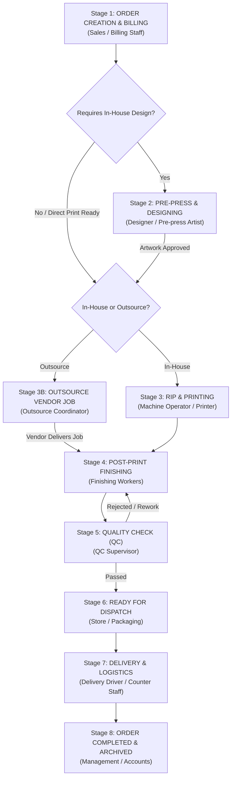

# 05. PRINTING PRODUCTION WORKFLOW & EXECUTION PIPELINE

## 1. Actual Production Pipeline Overview

In ScreenArts / Printflow Cloud ERP, an order progresses through an **8-Stage Production Lifecycle**. The workflow is configured to support both internal manufacturing (Flex, Vinyl, UV printing, lamination) and third-party subcontracting (Acrylic fabrication, Metal laser cutting, Offset batching).

---

## 2. Granular Stage-by-Stage Specification

### Stage 1: Order Creation & Billing Attribution
- **Database Status**: `sales_orders.production_status = 'New'`, `sales_order_items.production_status = 'New'`
- **Authorized Roles**: `Admin`, `Sales`, `Manager`
- **Employee Attribution Recorded**:
  - `sales_orders.billed_by_staff`: Name of operator (e.g. `Minhaj V (Admin)` or `Ramesh Sharma (Sales)`).
  - `sales_orders.billed_by_id`: Unique staff ID (e.g. `EMP-101`).
  - `sales_orders.billed_by_role`: Role at time of billing.
  - `sales_orders.billed_at`: System timestamp.
  - `sales_orders.sales_person_id` & `sales_orders.care_of_id`: Commission earners.
- **Data Recorded**:
  - Dimensions (`width`, `height`, `unit`), `qty`, `selling_rate`, `tax_type`, `gst_rate`, `advance_amount`, `balance_amount`, promised `due_date`.
  - Design requirement flag: `designer_required` (`YES` / `NO`).
  - Outsource requirement flag: `outsource` (`0` / `1`).
- **Next Possible Statuses**: `Designing` (if designer required), `Printing` (if print-ready), `Outsource` (if subcontracted).

---

### Stage 2: Pre-Press & Designing
- **Database Status**: `sales_orders.production_status = 'Designing'`, `sales_order_items.design_status`
- **Authorized Roles**: `Designer`, `Admin`
- **Accessible By**: Employees assigned to department `'Design'` via `DesignersView.jsx`.
- **Data Recorded**:
  - `sales_order_items.designer_id` & `designer_name`.
  - `sales_order_items.artwork_url`: Vector / PDF / TIFF high-res print file or proof link.
  - `sales_order_items.artwork_status`: `Pending`, `Received`, `Proof Sent`, `Approved`, `Revision Requested`.
  - Revision count and customer proofing notes.
- **Previous Status**: `New`.
- **Next Possible Statuses**: `Printing` (on approval), `Outsource` (on approval), `Cancelled`.

---

### Stage 3: Rip & Machine Printing (In-House)
- **Database Status**: `sales_orders.production_status = 'Printing'`
- **Authorized Roles**: `Production`, `Admin`, `Manager`
- **Accessible By**: Machine operators and printing department staff via `ProductionView.jsx` and `ProductionTasksView.jsx`.
- **Data Recorded**:
  - `sales_order_items.printer_id` & `printer_name`: Machine operator.
  - `production_tasks.machine_id` & `machine_name`: Specific printing asset (e.g., *Roland TrueVIS VG2-640 Eco-Solvent*, *Gongzheng Starfire 10ft Solvent Press*, *Handtop UV Flatbed 8x4ft*).
  - Substrate batch / roll ID used.
  - `start_time`: Timestamp when RIP process or print cycle began.
  - `end_time`: Timestamp when printing completed.
  - `total_duration_minutes`: Tracked via automated start/stop timers.
  - Scrap / Wastage footage in linear feet or square feet.
- **Previous Status**: `Designing` or `New`.
- **Next Possible Statuses**: `Finishing`, `Quality Check`.

---

### Stage 3B: Outsource Subcontracting (Parallel or Alternative)
- **Database Status**: `sales_orders.production_status = 'Outsource'`, `outsource_jobs.status = 'SENT' | 'RECEIVED'`
- **Authorized Roles**: `Purchase`, `Admin`, `Production`
- **Accessible By**: Production manager and procurement staff via `OutsourceVendorsView.jsx`.
- **Data Recorded**:
  - `outsource_jobs.supplier_id` & `supplier_name`.
  - `work_description` (e.g. *Laser cut 5mm golden mirror acrylic letters + LED module insertion*).
  - `outsource_cost`: Budgeted cost.
  - `actual_vendor_bill`: Final vendor bill amount.
  - `sent_date` & `expected_date`.
  - `received_date`: Timestamp when physical goods arrive back at ScreenArts warehouse.
- **Previous Status**: `New` or `Designing`.
- **Next Possible Statuses**: `Finishing`, `Quality Check`.

---

### Stage 4: Post-Print Finishing & Fabrication
- **Database Status**: `sales_orders.production_status = 'Finishing'`
- **Authorized Roles**: `Production`, `Admin`
- **Accessible By**: Finishing staff and workshop floor fabricators via `ProductionTasksView.jsx`.
- **Specific Tasks Supported**:
  - Thermal / Cold Roll Lamination (Gloss, Matte, Sparkle, Velvet).
  - Contour Die-Cutting & Plotting (Graphtec / Summa).
  - Banner Perimeter Hemming & Heavy-Duty Eyelet Punching.
  - Sunboard / Foam Board / Acrylic Mounting.
  - Signage LED wiring, frame welding, and standee assembly.
- **Data Recorded**:
  - `sales_order_items.finisher_id` & `finisher_name`.
  - `production_tasks.process_name` (e.g., `Flex Eyeletting`, `Sticker Scoring`).
  - Completed quantity vs original quantity.
  - Finishing time logs in `production_task_time_logs`.
- **Previous Status**: `Printing` or `Outsource`.
- **Next Possible Statuses**: `Quality Check`.

---

### Stage 5: Quality Check (QC) & Inspection
- **Database Status**: `sales_orders.production_status = 'Quality Check'`, `production_tasks.qc_status`
- **Authorized Roles**: `Admin`, `Manager`, `Production` (Supervisor level)
- **Data Recorded**:
  - `qc_status`: `Pending`, `Passed`, `Failed`, `Rework Required`.
  - `completed_qty`: Accepted salable units.
  - `rejected_qty`: Unusable defective units.
  - `rework_qty`: Units returned to printing or finishing for correction.
  - Defect category / reason (e.g. *Banding lines on vinyl*, *Color shade mismatch*, *Misaligned eyelets*, *Incorrect dimension*).
  - `attachment_url`: Photo proof of finished job or defect evidence.
  - `supervisor`: Name of QC officer signing off.
- **Previous Status**: `Finishing`.
- **Next Possible Statuses**: `Ready for Delivery` (if passed), `Printing` or `Finishing` (if rework required).

---

### Stage 6: Ready for Delivery & Packaging
- **Database Status**: `sales_orders.production_status = 'Ready for Delivery'`
- **Authorized Roles**: `Production`, `Delivery`, `Sales`, `Admin`
- **Data Recorded**:
  - Packaging type (Corrugated bundle, wooden crate, roll pack, bubble wrapped).
  - Storage rack / shelf location.
  - Automated WhatsApp notification link triggered: "Your order #SO-XXXX is printed and packed ready for collection!"
- **Previous Status**: `Quality Check`.
- **Next Possible Statuses**: `Delivered`.

---

### Stage 7: Delivery & Logistics Dispatch
- **Database Status**: `sales_orders.production_status = 'Delivered'`, `sales_orders.delivered_by`
- **Authorized Roles**: `Delivery`, `Sales`, `Admin`
- **Accessible By**: Delivery drivers, dispatch clerks, and counter staff via `DeliveryView.jsx`.
- **Dispatch Modes Supported**:
  1. `Customer Pickup`: Over-the-counter handover.
  2. `Own Delivery / Dispatch Van`: ScreenArts vehicle route.
  3. `Courier / Express Cargo`: Third-party courier tracking number recorded.
  4. `Heavy Road Transport`: Freight carrier waybill / LR number.
  5. `Partial Batch Delivery`: Partial quantity handover with pending balance quantity.
- **Data Recorded**:
  - `delivered_by`: Delivery executive name.
  - `sales_orders.signature_url`: Customer digital signature captured in real-time via `SignatureModal.jsx` canvas.
  - Final collection of balance dues (`sales_orders.balance_amount` settled via cash or UPI).
- **Previous Status**: `Ready for Delivery`.
- **Next Possible Statuses**: `Completed` / Archived.
