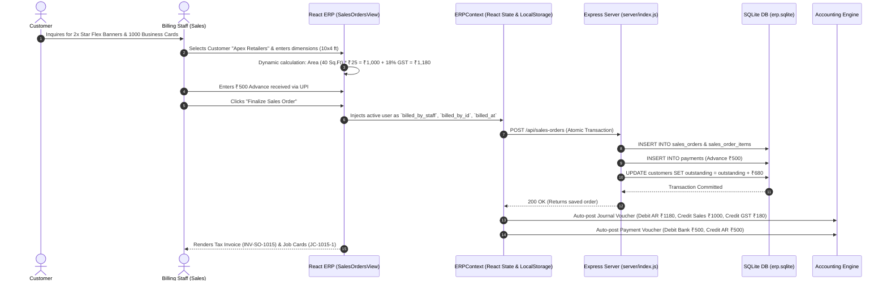
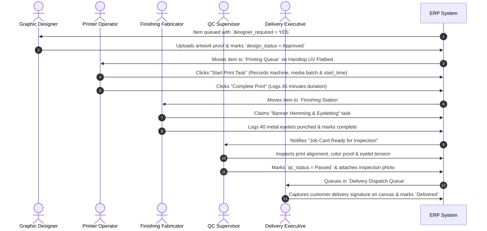

# 10. ERP SYSTEM DATA FLOW & TRANSACTION LIFECYCLES

## 1. Commercial Sales & Financial Pipeline Flow



---

## 2. Production Execution & Stage Routing Flow



---

## 3. Inventory & Procurement Flow: Theory vs Actual Reality

### Ideal Standard ERP Flow
$$\text{Purchase Order} \longrightarrow \text{Goods Receipt Note (GRN)} \longrightarrow \text{Stock Inward} \longrightarrow \text{Job Consumption} \longrightarrow \text{Stock Outward} \longrightarrow \text{Remaining Balance}$$

### Actual Current Implementation in Printflow ERP
1. **Raw Material Inward**:
   - Stock entries are created in `inventory` table with `current_stock` and `reorder_level`.
   - Purchase Orders can be drafted in `PurchaseView.jsx` and saved in `purchase_orders.items`.
2. **Production Stage Execution**:
   - Machine operators and finishing staff log tasks in `production_tasks`.
   - The square footage printed (`width * height * qty`) is captured in `sales_order_items`.
3. **The Current Architectural Gap**:
   > [!IMPORTANT]
   > **Stock Consumption is NOT currently auto-deducted in SQLite upon order completion.**
   > In the current version, when 500 Sq.Ft of Star Flex is printed and delivered, the `inventory.current_stock` for Star Flex remains unchanged unless the storekeeper manually navigates to `InventoryView.jsx` and clicks "Adjust Stock".
   > **Recommended Trigger**: Add an SQLite post-update trigger or Express handler on `/api/sales-orders/:orderId/items/:itemId/production-status` that executes:
   > ```sql
   > UPDATE inventory 
   > SET current_stock = current_stock - (item.width * item.height * item.qty) 
   > WHERE name = item.material;
   > ```
